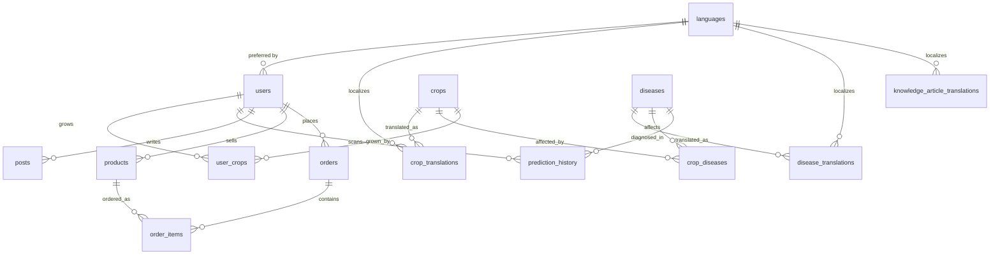

# LeafCare Database System - Technical Analysis Report

**Target Database Engine:** PostgreSQL 16+ (Verified on 16.14)  
**Schema Architecture:** 25 Tables | 75 Indexes | 123 Constraints | 15 ENUM Types | 9 Migrations  
**Primary Files:** [`db/README.md`](file:///c:/LEAFCARE/db/README.md), [`db/schema.sql`](file:///c:/LEAFCARE/db/schema.sql), [`docs/database-design.md`](file:///c:/LEAFCARE/docs/database-design.md)

---

## Executive Summary

The **LeafCare** database is a PostgreSQL 16 schema designed to support a multilingual, AI-powered agricultural advisory, crop disease diagnosis, community, and marketplace platform. It demonstrates exceptional database design practices: strong domain normalization, strict data integrity constraints, localized content delivery, unit-aware measurements, and tailored indexing strategies.

---

## Architecture & Module Breakdown

The schema is divided into 9 transactional migration modules (`0001` through `0009`), each fully reversible with matching `.up.sql` and `.down.sql` scripts.

### Module Breakdown

| Module | Schema File | Focus Area | Key Entities |
|---|---|---|---|
| **01 Foundation** | `0001_foundation.up.sql` | Extensions & Types | `pgcrypto`, `pg_trgm`, 15 ENUMs, `set_updated_at()` trigger |
| **02 Auth** | `0002_auth.up.sql` | Identity & Location | `languages`, `users` |
| **03 Crops** | `0003_crops.up.sql` | Agronomy Data | `crops`, `crop_translations`, `crop_seasons`, `user_crops`, `crop_companions` |
| **04 Diseases** | `0004_diseases.up.sql` | Pathology & Hosts | `diseases`, `disease_translations`, `crop_diseases` |
| **05 Predictions** | `0005_predictions.up.sql` | AI Scan Telemetry | `prediction_history` |
| **06 Community** | `0006_community.up.sql` | Social Feed | `posts`, `comments`, `likes` |
| **07 Marketplace** | `0007_marketplace.up.sql` | E-Commerce | `products`, `orders`, `order_items`, `reviews` |
| **08 Notifications**| `0008_notifications.up.sql` | User Alerts | `notifications` |
| **09 Knowledge** | `0009_knowledge_base.up.sql` | CMS & Articles | `knowledge_categories`, `knowledge_articles` + junction tables |

---

## Core Architectural Wins & Key Innovations

### 1. Localization & Multilingual Engine
* **Natural Primary Keys for Languages:** Uses ISO 639-1 code (`en`, `ta`, `hi`, `te`, `ml`, `kn`) as PK for `languages`, avoiding useless surrogate UUID joins.
* **Separation of Locales:** `crops` and `diseases` hold only language-agnostic data (pH ranges, temperatures, scientific names). All human-readable strings live in `<entity>_translations` tables with composite PK `(entity_id, language_code)`.
* **Array-based Lists:** Symptoms, causes, prevention, and treatments are stored as `TEXT[]` arrays in `disease_translations`, preserving ordered bullet boundaries without cluttering the database with 5 separate join tables.

### 2. Domain Correctness & Unit Preservation
* **Typed Numeric Min/Max Ranges:** Agronomic data (`temperature_min_c`/`max_c`, `ph_min`/`max`, rainfall, spacing) is stored as queryable numeric pairs rather than static display strings like `"15–24°C"`.
* **Nutrient Unit Preservation:** Implements `nutrient_unit` ENUM (`kg_per_ha` vs `g_per_plant`) to handle field crops (e.g. Rice in kg/ha) vs orchard crops (e.g. Apple in g/plant). Storing raw numbers without units would be off by 3 orders of magnitude.

### 3. Financial & Operational Integrity
* **Price & Title Snapshotting:** `order_items` snapshots `unit_price` and `product_name` at purchase time. Editing a product's price in `products` will never alter past order records.
* **Deletion Restrict Policies:** `ON DELETE RESTRICT` is enforced on `orders.buyer_id` and `order_items.product_id` to guarantee financial auditing compliance.
* **Strict Uniqueness without Surrogate Bloat:** `likes` uses `(post_id, user_id)` PK, and `user_crops` uses a partial unique index (`WHERE is_primary`) to enforce at most 1 primary crop per user.

### 4. Search & Performance Strategy (75 Indexes)
* **Trigram Fuzzy Search:** `pg_trgm` GIN indexes on crop, disease, and product titles (`crop_translations_name_trgm_idx`, etc.).
* **Full-Text Search (FTS):** GIN index over article title, summary, and body text (`knowledge_article_translations_fts_idx`).
* **Partial Indexes:** Indexes scoped with `WHERE deleted_at IS NULL` (soft deletes) and `WHERE is_read = false` (notification badge speed).
* **Composite Access Indexes:** Double-column indexes for fast dashboard timeline filtering (e.g. `(user_id, prediction_date DESC)`).

---

## Verification & Quality Assurance Status

The schema has been fully executed and verified against **PostgreSQL 16.14** in Docker:
* ✅ Full forward migration pass on empty database.
* ✅ Idempotent seed loading (`001_languages.sql`, `002_crops.sql`, `003_diseases.sql` re-executed cleanly via `ON CONFLICT`).
* ✅ Full 9-step reverse rollback (`.down.sql` sequence leaves 0 lingering tables or enums).
* ✅ 12 constraint violation edge-cases tested and verified (e.g., preventing latitude without longitude, preventing healthy scan with disease ID, enforcing rating between 1 and 5).

---

## Future Scalability Recommendations

1. **Near-Term (Read Optimization):**
   - Add a SQL view for translation fallback to `'en'` when a requested language localization is missing.
   - Introduce a materialized view `product_rating_summary` for marketplace star ratings as review volume grows.
2. **Medium-Term (Data Growth & Geo):**
   - Partition `prediction_history` by range (monthly) as AI diagnostic scans scale into millions of rows.
   - Upgrade numeric `latitude`/`longitude` to PostGIS `geography(Point, 4326)` for radius-based outbreak alerts (e.g., "diseases within 50 km").
3. **Long-Term (Platform Capabilities):**
   - Implement `prediction_feedback` table to capture user feedback on AI predictions to feed back into model retraining loops.
   - Enable Row-Level Security (RLS) if opening direct API access (e.g. PostgREST/Supabase).
