# LeafCare Database Design

PostgreSQL 16 schema for a multilingual, AI-powered crop disease detection platform.

**Status:** applied and verified against PostgreSQL 16.14 — 25 tables, 75 indexes, 123 constraints.
See [Verification](#verification) for what was actually executed.

---

## Contents

1. [Entity relationship diagram](#entity-relationship-diagram)
2. [Module overview](#module-overview)
3. [Table-by-table rationale](#table-by-table-rationale)
4. [Index inventory](#index-inventory)
5. [Constraint inventory](#constraint-inventory)
6. [Deliberate deviations from the brief](#deliberate-deviations-from-the-brief)
7. [Verification](#verification)
8. [Future scalability](#future-scalability)

---

## Entity relationship diagram

```mermaid
erDiagram
    languages ||--o{ users : "preferred by"
    languages ||--o{ crop_translations : localizes
    languages ||--o{ disease_translations : localizes
    languages ||--o{ knowledge_article_translations : localizes
    languages ||--o{ knowledge_category_translations : localizes

    users ||--o{ user_crops : grows
    users ||--o{ prediction_history : scans
    users ||--o{ posts : writes
    users ||--o{ comments : writes
    users ||--o{ likes : gives
    users ||--o{ products : sells
    users ||--o{ orders : places
    users ||--o{ reviews : writes
    users ||--o{ notifications : receives

    crops ||--o{ crop_translations : "translated as"
    crops ||--o{ crop_seasons : "sown in"
    crops ||--o{ user_crops : "grown by"
    crops ||--o{ crop_companions : "paired with"
    crops ||--o{ crop_diseases : "affected by"
    crops ||--o{ posts : "discussed in"
    crops ||--o{ prediction_history : "identified in"
    crops ||--o{ knowledge_article_crops : "covered by"

    diseases ||--o{ disease_translations : "translated as"
    diseases ||--o{ crop_diseases : affects
    diseases ||--o{ prediction_history : "diagnosed in"
    diseases ||--o{ knowledge_article_diseases : "covered by"

    posts ||--o{ comments : has
    posts ||--o{ likes : receives

    products ||--o{ order_items : "ordered as"
    products ||--o{ reviews : receives
    orders ||--o{ order_items : contains

    knowledge_categories ||--o{ knowledge_articles : groups
    knowledge_categories ||--o{ knowledge_category_translations : "translated as"
    knowledge_articles ||--o{ knowledge_article_translations : "translated as"
    knowledge_articles ||--o{ knowledge_article_crops : "linked to"
    knowledge_articles ||--o{ knowledge_article_diseases : "linked to"

    languages {
        text language_code PK
        text language_name
        text native_name
        boolean is_active
    }
    users {
        uuid id PK
        text name
        text email UK
        text password_hash
        user_role role
        text language_code FK
        text district
        text state
        numeric latitude
        numeric longitude
        numeric farm_size_acres
        smallint experience_years
        timestamptz deleted_at
    }
    crops {
        uuid id PK
        text slug UK
        text scientific_name
        numeric temperature_min_c
        numeric temperature_max_c
        numeric ph_min
        numeric ph_max
        crop_life_cycle life_cycle
        nutrient_unit nutrient_unit
        numeric nitrogen_requirement
        numeric phosphorus_requirement
        numeric potassium_requirement
    }
    crop_translations {
        uuid crop_id PK_FK
        text language_code PK_FK
        text crop_name
        text description
    }
    crop_companions {
        uuid crop_id PK_FK
        uuid companion_crop_id PK_FK
        companion_relationship relationship
    }
    diseases {
        uuid id PK
        text slug UK
        text scientific_name
        disease_severity severity
        pathogen_type pathogen_type
        boolean contagious
    }
    disease_translations {
        uuid disease_id PK_FK
        text language_code PK_FK
        text disease_name
        text_array symptoms
        text_array causes
        text_array prevention
        text_array organic_treatment
        text_array chemical_treatment
    }
    crop_diseases {
        uuid crop_id PK_FK
        uuid disease_id PK_FK
        boolean is_primary_host
        disease_severity severity_override
    }
    prediction_history {
        uuid id PK
        uuid user_id FK
        uuid crop_id FK
        uuid disease_id FK
        boolean is_healthy
        text uploaded_image
        numeric confidence
        text model_version
        timestamptz prediction_date
    }
    posts {
        uuid id PK
        uuid user_id FK
        uuid crop_id FK
        post_category category
        text title
        timestamptz deleted_at
    }
    likes {
        uuid post_id PK_FK
        uuid user_id PK_FK
    }
    products {
        uuid id PK
        uuid seller_id FK
        product_category category
        numeric price
        text unit
        boolean is_organic
        timestamptz deleted_at
    }
    orders {
        uuid id PK
        uuid buyer_id FK
        numeric total_price
        text delivery_address
        order_status status
    }
    order_items {
        uuid id PK
        uuid order_id FK
        uuid product_id FK
        text product_name
        integer quantity
        numeric unit_price
    }
    reviews {
        uuid id PK
        uuid product_id FK
        uuid user_id FK
        smallint rating
    }
    notifications {
        uuid id PK
        uuid user_id FK
        notification_type type
        timestamptz read_at
        boolean is_read
    }
    knowledge_articles {
        uuid id PK
        uuid category_id FK
        text slug UK
        timestamptz published_at
    }
```



---

## Module overview

| Migration | Module | Tables |
|---|---|---|
| `0001_foundation` | Extensions, 15 ENUM types, `set_updated_at()` | — |
| `0002_auth` | Authentication | `languages`, `users` |
| `0003_crops` | Agronomy | `crops`, `crop_translations`, `crop_seasons`, `user_crops`, `crop_companions` |
| `0004_diseases` | Pathology | `diseases`, `disease_translations`, `crop_diseases` |
| `0005_predictions` | AI history | `prediction_history` |
| `0006_community` | Social | `posts`, `comments`, `likes` |
| `0007_marketplace` | Commerce | `products`, `orders`, `order_items`, `reviews` |
| `0008_notifications` | Messaging | `notifications` |
| `0009_knowledge_base` | Content | `knowledge_categories` + translations, `knowledge_articles` + translations, 2 link tables |

---

## Table-by-table rationale

### `languages`

The ISO 639-1 code is the **primary key** rather than a surrogate UUID. It is short, stable, human-readable, and already the value carried in URLs and the client's stored preference — so using it directly removes a join from every translated read and makes `crop_translations` rows self-describing in a query result.

### `users`

Stores `latitude`/`longitude` alongside `district`/`state`. The district drives advisory content, but the weather service needs coordinates; caching them avoids re-geocoding on every forecast request. A CHECK enforces that the two coordinate columns are set together — a latitude without a longitude is not a location.

Email uniqueness is a **partial unique index on `lower(email)` scoped to live rows**, so matching is case-insensitive and a deleted account does not permanently reserve its address.

`password_hash`, never `password`. A column named `password` invites someone to put a password in it.

### `crops`

Holds **only language-independent agronomy**. Every human-readable string lives in `crop_translations`.

Ranges are stored as typed numeric min/max pairs (`temperature_min_c` / `temperature_max_c`) rather than display strings like `'15–24 °C'`. This is the single most consequential decision in the schema: it makes ranges queryable ("crops viable at 30 °C"), comparable, and formattable per locale at render time. A text range supports none of that.

`nutrient_unit` exists because the source data quotes nutrients in two incompatible units — **kg/ha for field crops, g/plant for orchard crops**. Apple is `200 g/tree`; rice is `100 kg/ha`. Without the unit column those numbers are not merely unformatted, they are wrong by three orders of magnitude. A CHECK constraint forbids storing a nutrient figure without its unit.

`slug` is a stable, human-readable key used in URLs (`/catalog/rice`) and as the AI model's class label. Keeping it separate from the UUID lets either change without breaking the other.

### `crop_translations`, `disease_translations`

Composite primary key `(entity_id, language_code)` — this *is* the required uniqueness constraint, so no surrogate key or extra index is needed.

Disease list fields (`symptoms`, `causes`, `prevention`, `organic_treatment`, `chemical_treatment`) are `TEXT[]`. They are ordered lists rendered as bullets. An array preserves item boundaries without a further table per list, and each element stays individually translatable. A single blob would lose the boundaries; a table per list would add five joins to render one screen.

### `crop_seasons`

A crop can be sown in more than one season (tomato in both kharif and rabi), so season is a set, not a column. Modelling it as a column would violate 1NF the moment a second season is needed.

### `user_crops`

The gap that most needed closing: selecting your crops is a core onboarding step that drives dashboard personalisation and the default crop for a scan, and the previous design had nowhere to record it.

A partial unique index (`WHERE is_primary`) allows at most one primary crop per farmer — expressible as an index, not as a CHECK.

### `crop_companions`

Self-referencing many-to-many with a `relationship` enum. A CHECK forbids a crop being its own companion. Rows are stored **directionally** and the seed inserts both directions, so a query filtered on one `crop_id` returns the complete set without a `UNION`.

Companion partners that are not themselves catalogued crops (marigold, clover) belong in the knowledge base — this table only relates crops that exist in `crops`.

### `crop_diseases`

Many-to-many, replacing the single `diseases.crop_id` FK. Late blight affects **both potato and tomato**; anthracnose affects many hosts. `severity_override` records that a pathogen can be more damaging on one host than another.

### `prediction_history`

Append-only. A prediction is a record of what the model said at a moment in time and is never edited, so there is no `updated_at`; `deleted_at` lets a user clear their history without destroying model telemetry.

`crop_id` and `disease_id` are **both nullable on purpose**: the model may recognise a disease without confidently identifying the crop, and a healthy leaf produces no disease at all. A CHECK enforces that a healthy result cannot also name a disease.

`model_version` is essential for evaluating a rollout and for re-scoring history after a retrain.

`uploaded_image` must be an object-storage URL. The client currently produces base64 data URLs; storing those would inflate every row, defeat caching, and prevent CDN delivery.

### `posts`

Carries both `crop_id` (nullable) and `category`, because the feed filters on each independently. `crop_id` is nullable since a weather question need not name a crop.

### `likes`

Composite primary key `(post_id, user_id)`. **This is the uniqueness guarantee** — without it a user can like the same post repeatedly and every count in the feed becomes fiction. A surrogate `id` would add a column and an index for no benefit.

### `products`

`rating` and `review_count` are deliberately **absent**; both are derivable from `reviews`, and storing them invites drift. See [Future scalability](#future-scalability) for the materialised-view path if the aggregate becomes a hot path.

`unit` is free text rather than an ENUM: sellers list by bottle, bag, packet, kg and litre, and the set grows with the catalogue. `currency_code` is present from day one — retrofitting currency into a live orders table is painful.

### `orders` / `order_items`

Split so one order can contain several products. The previous single-table design forced a three-item purchase into three separate orders.

`order_items.unit_price` and `product_name` are **snapshotted at purchase time**. Without the snapshot, a seller editing a price or title silently rewrites the value and contents of every historical order — a correctness bug that only surfaces at audit time.

`orders.buyer_id` uses `ON DELETE RESTRICT`: financial records must survive account deletion. Anonymise the user row instead of removing it. `order_items.product_id` likewise restricts, so a product with order history cannot be hard-deleted (soft-delete it).

`total_price` must equal `SUM(quantity * unit_price)`. PostgreSQL CHECK cannot span tables, so this is an application-transaction invariant — a candidate for a deferred constraint trigger if it ever drifts.

### `notifications`

`read_at TIMESTAMPTZ` carries strictly more information than a boolean (it answers *when*), and `is_read` is a `GENERATED ALWAYS AS (read_at IS NOT NULL) STORED` column, so the flag can never disagree with the timestamp. A partial index on unread rows powers the badge without scanning read history.

### Knowledge base

Replaces the orphan `catalog` table, which had no foreign key to anything.

- **Categories are a table, not an ENUM**, precisely because "allow future expansion" is a requirement and ENUM values cannot be removed or reordered.
- Articles link to subjects through two narrow junction tables (`knowledge_article_crops`, `knowledge_article_diseases`) rather than a polymorphic `(entity_type, entity_id)` pair. **A polymorphic column cannot carry a foreign key**, so the database could not stop an article pointing at a crop that no longer exists.
- `published_at IS NULL` means draft. Publishing is a timestamp rather than a boolean so content can be scheduled.

---

## Index inventory

75 indexes. Every index required by the brief is present, plus the additions noted below.

### Required by the brief

| Index | Table | Notes |
|---|---|---|
| `prediction_history_user_id_idx` | prediction_history | |
| `prediction_history_prediction_date_idx` | prediction_history | DESC |
| `posts_created_at_idx` | posts | DESC, partial on live rows |
| `posts_category_idx` | posts | composite with `created_at DESC` |
| `posts_crop_id_idx` | posts | composite with `created_at DESC` |
| `comments_post_id_idx` | comments | composite with `created_at` |
| `likes_post_id_idx` | likes | |
| `products_category_idx` | products | composite with `created_at DESC` |
| `products_seller_id_idx` | products | |
| `orders_buyer_id_idx` | orders | composite with `ordered_at DESC` |
| `reviews_product_id_idx` | reviews | composite with `created_at DESC` |
| `user_crops_user_id_idx` | user_crops | |
| `crop_translations_language_code_idx` | crop_translations | |
| `disease_translations_language_code_idx` | disease_translations | |

### Additional

| Index | Why |
|---|---|
| `prediction_history_user_recent_idx` | `(user_id, prediction_date DESC)` — the actual dashboard query is "my recent scans", which a single-column index serves poorly |
| `prediction_history_disease_date_idx` | Outbreak analytics: confirmed cases of a disease in the last N days |
| `notifications_unread_idx` | Partial index on unread rows — the badge query never touches read history |
| `user_crops_one_primary_idx` | Partial unique index enforcing at most one primary crop per user |
| `crop_translations_name_trgm_idx` | GIN trigram index for fuzzy catalogue search |
| `disease_translations_name_trgm_idx` | Same, for disease lookup |
| `products_name_trgm_idx` | Same, for marketplace search |
| `knowledge_article_translations_fts_idx` | GIN full-text index over title + summary + body |
| `users_district_state_idx` | Regional advisories and outbreak alerts by area |
| `orders_status_idx` | Seller fulfilment queue |

**Composite ordering:** the leading column is always the equality filter and the trailing column the sort key, so one index serves both. **Partial indexes** (`WHERE deleted_at IS NULL`) keep soft-deleted rows out of the index entirely, which matters more as the delete ratio grows.

---

## Constraint inventory

123 constraints. Highlights beyond the routine NOT NULLs and foreign keys:

| Constraint | Table | Guarantees |
|---|---|---|
| `users_coordinates_paired` | users | latitude and longitude are set together |
| `crops_ph_range` | crops | `ph_min <= ph_max` |
| `crops_temperature_range` | crops | min ≤ max (same for rainfall, humidity, both spacings) |
| `crops_nutrient_unit_required` | crops | no nutrient figure without its unit |
| `crop_companions_not_self` | crop_companions | a crop is not its own companion |
| `prediction_healthy_has_no_disease` | prediction_history | a healthy scan cannot name a disease |
| `prediction_history_confidence_check` | prediction_history | confidence ∈ [0, 100] |
| `reviews_rating_check` | reviews | rating ∈ [1, 5] |
| `reviews_one_per_user` | reviews | one review per user per product |
| `order_items_unique_product` | order_items | one line per product per order |
| `likes_pkey` | likes | one like per user per post |
| `order_items_product_id_fkey` | order_items | RESTRICT — cannot delete an ordered product |

### `ON DELETE` policy

| Behaviour | Applied to | Reasoning |
|---|---|---|
| `CASCADE` | Translations, junction rows, a user's own posts/comments/likes/notifications | Dependent rows are meaningless without the parent |
| `SET NULL` | `prediction_history.crop_id` / `disease_id`, `posts.crop_id`, `knowledge_articles.author_id` | Retiring reference data must not delete history |
| `RESTRICT` | `orders.buyer_id`, `order_items.product_id`, `knowledge_articles.category_id`, all `language_code` FKs | Financial and content integrity outrank convenience |

---

## Deliberate deviations from the brief

Four places where the implementation departs from the specification. Each is a judgment call, flagged so it can be overruled.

1. **`temperature_range`, `rainfall`, `humidity` → numeric min/max pairs.** The brief lists single columns. Storing `'15–24 °C'` as text makes the value unqueryable and unformattable per locale. This is the change that most improves domain correctness.

2. **`nutrient_unit` added.** Not in the brief, but the source data mixes kg/ha and g/plant. Without it the nutrient figures are ambiguous.

3. **`likes` has no surrogate `id`.** The brief lists `id` plus `UNIQUE (post_id, user_id)`. A composite primary key delivers exactly that guarantee with one fewer column and one fewer index.

4. **`notifications.is_read` is a generated column** derived from `read_at`, rather than an independently writable boolean. Same field name and type as specified; the flag simply cannot drift from the timestamp.

Additions beyond the brief: `crop_seasons`, `pathogen_type`, `is_primary_host`/`severity_override`, `currency_code`, `link_url`, `slug` on crops and diseases, `native_name` on languages, and `deleted_at` soft-delete columns.

---

## Verification

Everything below was executed against **PostgreSQL 16.14** in Docker, not merely reviewed.

| Check | Result |
|---|---|
| `db/schema.sql` applies to an empty database | Clean, no errors |
| All three seed files apply | Clean |
| Seeds re-applied a second time | Clean — idempotent via `ON CONFLICT` |
| All 9 down-migrations, reverse order | Clean; **0 tables and 0 ENUM types left behind** |
| Full re-apply after teardown | Clean |
| 12 constraint-violation attempts | All 12 correctly rejected |
| `updated_at` trigger | Equal to `created_at` on insert; advances on update |
| `is_read` generated column | `false` → `true` when `read_at` is set |
| Cross-crop disease query | Late Blight correctly returns **Potato, Tomato** |
| Tamil catalogue read | 6 crops with correct native names and pH ranges |

Reproduce with:

```bash
docker run -d --name leafcare-pg -e POSTGRES_PASSWORD=pw -e POSTGRES_DB=leafcare \
  -p 55432:5432 postgres:16-alpine
docker cp db leafcare-pg:/db
docker exec leafcare-pg sh -c 'cd /db && psql -U postgres -d leafcare -v ON_ERROR_STOP=1 -f schema.sql'
docker exec leafcare-pg sh -c 'cd /db/seeds && for f in *.sql; do psql -U postgres -d leafcare -v ON_ERROR_STOP=1 -f $f; done'
```

**Not yet verified:** query plans under realistic data volumes. Every index here is justified by an expected access pattern, but index value is only proven by `EXPLAIN ANALYZE` against production-scale data. Re-examine once real traffic exists.

---

## Future scalability

### Near term

**Derived review aggregates.** `products.rating` is computed today. When the marketplace listing becomes read-heavy, add a materialised view rather than columns on `products`:

```sql
CREATE MATERIALIZED VIEW product_rating_summary AS
SELECT product_id, round(avg(rating), 2) AS rating, count(*) AS review_count
FROM reviews GROUP BY product_id;
CREATE UNIQUE INDEX ON product_rating_summary (product_id);
-- REFRESH MATERIALIZED VIEW CONCURRENTLY product_rating_summary;
```

This keeps `reviews` the single source of truth; a stale view is a refresh-lag problem, whereas stale columns are a data-integrity problem.

**Translation fallback.** Reads should `LEFT JOIN` the requested language and fall back to `'en'`, mirroring the client's existing `t()` behaviour. Worth encapsulating in a view or SQL function so no caller forgets the fallback and renders blanks.

**Full-text search per language.** The FTS index uses the `simple` configuration because the corpus spans six languages and PostgreSQL ships no stemmer for Tamil, Telugu, Malayalam or Kannada. If search quality matters, store a `regconfig` per row and index accordingly, or move search to a dedicated engine.

### Medium term

**Partition `prediction_history` by month.** It is the fastest-growing table (one row per scan, forever) and is almost always queried by recent date. Range partitioning on `prediction_date` keeps indexes small and makes archival a `DETACH PARTITION` instead of a mass `DELETE`.

**Move images to object storage.** `uploaded_image` and every `image_url` should be S3/R2/GCS keys behind a CDN. Never let base64 data URLs reach the database.

**PostGIS for spatial queries.** `latitude`/`longitude` are plain numerics today, which is right for storage. The moment you need "outbreaks within 50 km of this farm", add PostGIS and a `geography(Point, 4326)` generated column with a GiST index — the current columns migrate cleanly into it.

**Outbreak detection.** `prediction_history` joined to `users.district` already contains the data for regional disease alerts. A scheduled rollup into a `district_disease_daily` table would let the notification service fire `disease_alert` notifications without scanning raw history.

### Longer term

**Audit trail.** Marketplace and advisory changes will eventually need "who changed what, when". A generic `audit_log` table written by trigger is cheaper to add now than to backfill later.

**Row-level security.** If sellers ever get direct database access through PostgREST or Supabase, RLS policies on `products`, `orders` and `prediction_history` become the enforcement point rather than application code.

**Model feedback loop.** Add `prediction_feedback (prediction_id, user_id, was_correct, corrected_disease_id)` to capture farmer corrections. That is the highest-value training signal the platform can collect, and `model_version` is already recorded to make the data usable.

**ENUM churn.** `post_category`, `product_category` and `notification_type` are the ENUMs most likely to grow. `ALTER TYPE ... ADD VALUE` is online and cheap; *removing* a value is not. If any of these starts changing more than annually, convert it to a lookup table.
